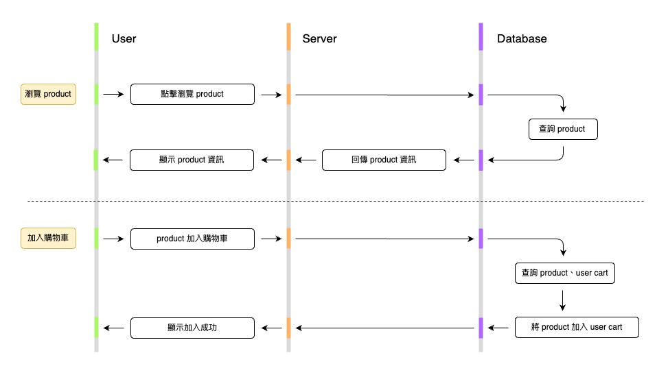
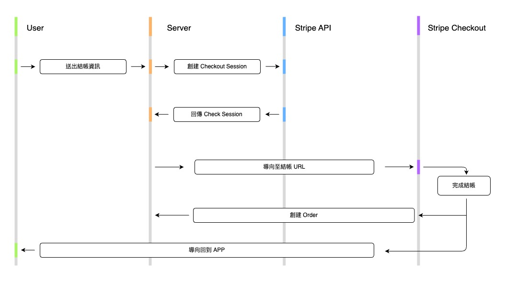
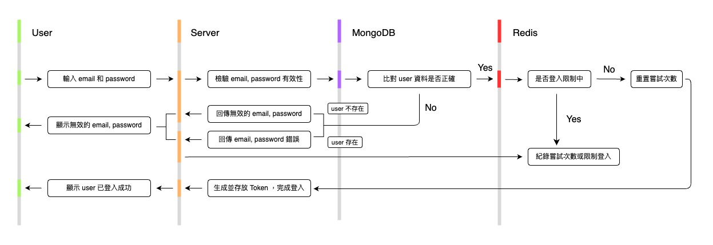
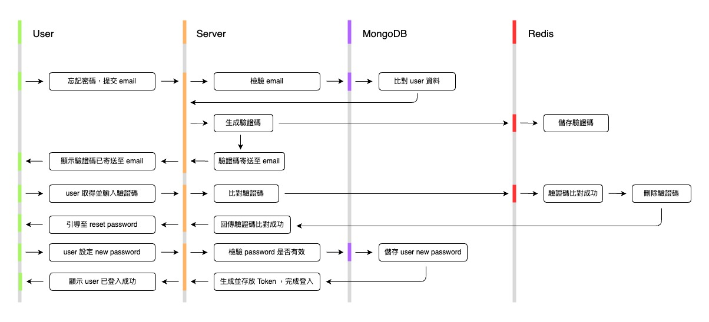

# PowMart-電商平台網站

**See Here**：https://jack-e-commerce-75ebcc27b086.herokuapp.com

歡迎來到我的 **PowMart** 的專案！  
這是一個現代化、功能豐富的線上購物平台，旨在提供流暢的購物體驗。

## 項目背景

此專案是為了學習並演示完整的 Web 全端開發而構建。  
模擬真實的電商網站，包含從商品管理到用戶購物的完整功能流程。

## 核心功能

- **商品瀏覽和購物車管理**：用戶可以瀏覽商品並將其加入購物車，後端處理商品數量的更新或添加。

  

- **結帳流程**：使用 Stripe 進行結帳，包括創建 checkout session 和處理訂單紀錄。

  

- **用戶驗證**：用戶登入和密碼重設功能，並實現登入嘗試限制。

  

  

- **API 權限管理**：通過 middleware 實現 API 訪問控制，僅授權用戶可使用特定功能。

  

詳細業務邏輯請參閱：[business-logic](./docs/business-logic.md)

## 安裝與設定

- **使用本專案的建議版本**

  - Node.js：20.x 或以上您可以在專案根目錄添加 .nvmrc 文件來指定 Node.js 版本：

    ```bash
    v20.18.0
    ```

  - express：4.21.0
  - MongoDB：6.x 或以上
  - mongodb：6.9.0
  - mongoose：8.7.0
  - ioredis：5.4.1
  - redis：4.7.0
  - jsonwebtoken：9.0.2
  - stripe：17.3.1

- **複製專案**

  - **請先複製此專案到本地**

    ```bash
    git clone https://github.com/Jake85631200/E-commerce-project
    ```

  - **安裝**

    ```bash
    npm install
    ```

- **環境變數**

  - **請在您的根目錄新增 .env 文件，並設置環境變數：**

    ```bash
    PORT=3000
    NODE_ENV=development

    # MongoDB 配置
    DATABASE=mongodb+srv://<USERNAME>:<PASSWORD>@e-commerce-project.mongodb.net/
    DATABASE_PASSWORD=your_password_here

    # Redis 配置
    REDIS_ENDPOINT_USERNAME=default
    REDIS_ENDPOINT_URI=redis://<REDIS_HOST>:<REDIS_PORT>
    REDIS_ENDPOINT_PASSWORD=<YOUR_REDIS_PASSWORD>

    # JWT 配置
    JWT_SECRET=<YOUR_JWT_SECRET_KEY>
    JWT_EXPIRES_IN=7d
    JWT_COOKIE_SECRET=<YOUR_JWT_COOKIE_SECRET>
    JWT_COOKIE_EXPIRES_IN=30
    .
    .
    .
    ```

    更多環境變數設置請參考[ config-template ](./config-template.env)

- **資料庫設定**

  - 如果使用本地 MongoDB，請確保 MongoDB 伺服器正在運行。
  - 如果使用 MongoDB Atlas，請在 .env 文件設置並連結您的 MongoDB Atlas，並確保已在 IP 白名單中添加了本機 IP。

- **CLI 指令**

  - **在測試環境啟動伺服器**

    ```bash
    npm start
    ```

  - **在生產環境啟動伺服器**

    ```bash
    npm run start:prod
    ```

## 技術棧

- **後端**：使用 Node.js (Express) 架設
- **前端**：使用 HTML, CSS, JavaScript 手刻網頁佈局
- **資料庫**：
  1. 串接至 MongoDB 並使用 Mongoose 進行資料設計和資料庫操作
  2. 使用 Redis 儲存短期資料 (驗證碼)
- **第三方支付**：使用 Stripe API 處理第三方支付並建立訂單
- **部署**：使用 Heroku 自動連接至 Github 更新部署
